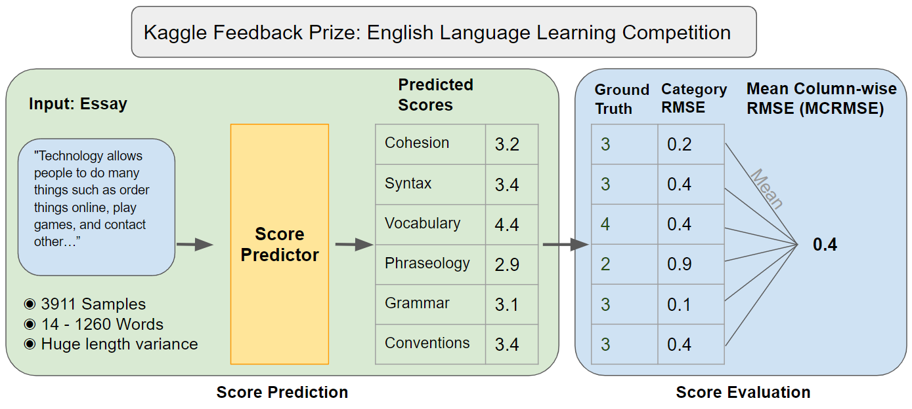
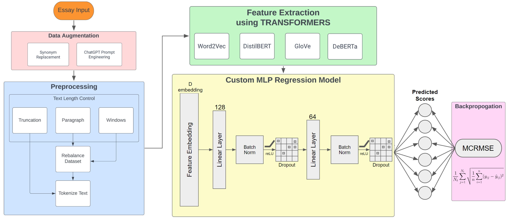

# Kaggle Feedback Prize: English Language Learning Competition

## → Multi-Aspect Automated Essay Scoring using Pretrained Transformer-Based Language Models

This group project was done as part of the University of Toronto's Deep Learning course.

-----

### Context

The recent advancements in natural language processing (NLP) and the introduction of advanced transformer-based language models, such as GPT-3 and Bert, have opened up new possibilities for real-world applications. One such application is Automated Essay Scoring (AES), which can significantly assist teachers in efficiently evaluating students' essays, particularly for English language learners. Our project aims to implement and explore the capabilities of pretrained transformer-based language models in addressing this challenging multi-aspect task, while also investigating creative modifications to improve their performance.

Automated Essay Scoring is an AI problem due to the complex nature of language understanding and the need for accurately assessing multiple aspects of an essay, such as cohesion, syntax, vocabulary, phraseology, grammar, and conventions. By employing various transformer-based models and techniques our goal is to achieve superior performance and provide valuable tools to teachers. Specifically considering the teacher shortage in Ontario and globally, this would ultimately help reduce workload, and support teachers in providing more personalized feedback to students, enhancing the educational experience.

### Kaggle Competition

## Main pipeline

**→ Leveraging transfer learning with pre-trained transformer-based models for feature extraction, followed by a custom MLP regressor to accurately grade essays across multiple criteria.**

## Results and Insights

### Performance

Our multi-aspect automated essay scoring model has performed well, achieving an average RMSE loss of 0.46. This surpasses the baseline model's performance (0.66) and is comparable to the Kaggle competition winner's score of 0.44. Through testing on new data, we demonstrated the model's ability to distinguish between good and poor essays, as well as its limitations when evaluating a scientific abstract.

### Model Conservatism

Our model displayed conservatism in its predictions, not predicting extremely high or low scores. This was evident when inputting a blank essay and receiving an average score of 2.18. It highlights the influence of the loss function on the model's behavior. Future work may involve incorporating a variance term into the loss function to achieve a more accurate fit to the data.

### Dataset Quality and Scope

A critical takeaway is the importance of dataset quality and scope. While our model performed well on high school essays, it struggled when assessing a scientific abstract, as it was not trained on this type of text. This underscores the need to consider dataset relevance and scope when developing AI models.

## Conclusion

In conclusion, our automated essay scoring model has demonstrated strong performance. Our team has gained valuable insights into the strengths and limitations of NLP models and the significance of dataset quality and scope for specific tasks. This project contributes to the advancement of educational technology and provides a foundation for further research in the field of automated essay scoring.

-----

## Authors: 
- Khaled Gaber 
- Alexis Bruneau 
- Kevin Mano
- Anton Korikov 
- Florian Schneider 